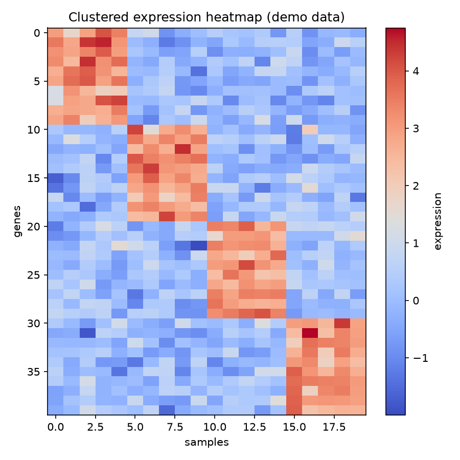

# Hierarchical Clustering Heatmap

A list of differentially expressed genes tells you *what* changed. A clustered heatmap shows you what changed *together* — and that is usually where the biology actually lives.

## Why This Matters

Co-regulated genes move as modules, and samples of the same type share expression patterns. Hierarchical clustering reorders the rows and columns so those modules line up, turning a noisy matrix into visible structure you can reason about — no prior labels required.

## How It Works

1. Compute distances between genes and between samples.
2. Build dendrograms with Ward linkage.
3. Reorder the matrix by both dendrograms and render it as a heatmap.

## What the Demo Shows



The demo plants four co-expression blocks in synthetic data. After clustering, those blocks appear as bright squares along the diagonal — the modules recovered automatically, which is how you would spot a co-regulated gene programme in real data.

## Run It

```bash
pip install -r requirements.txt
python demo.py
```

> Demonstrated on synthetic data, so the whole thing is reproducible with no external downloads.
